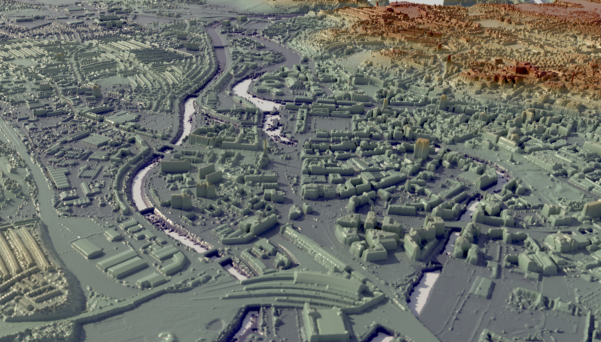
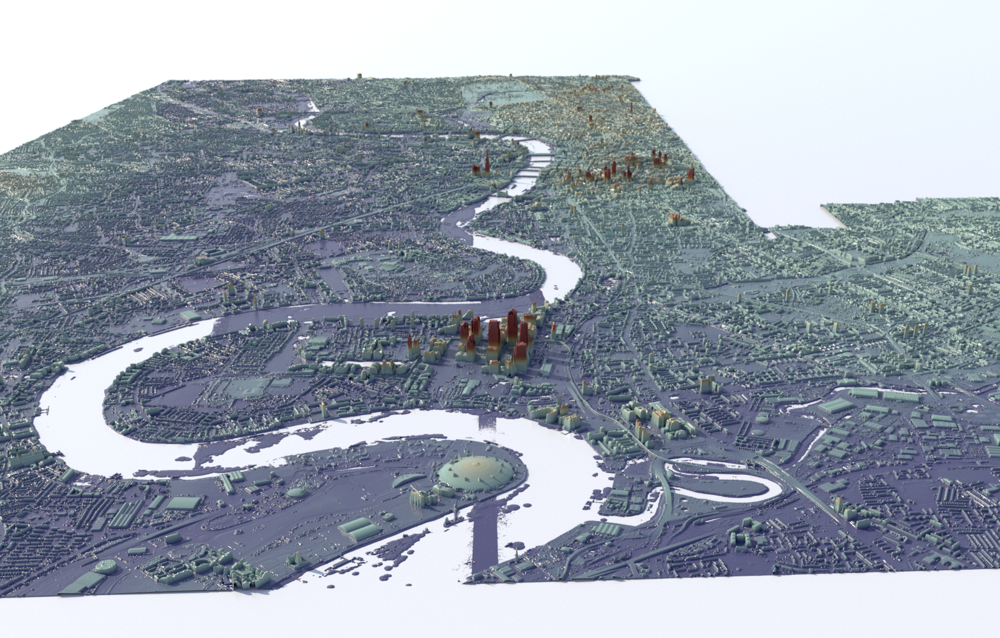

# lidartoa

</a></a>
</a></a>

This script converts .asc files containing DTM/DSM raster maps into an Arnold .ass file and companion EXR files, for displacement map rendering.

The script is currently setup to parse .asc files specifically downloaded from https://data.gov.uk/dataset/80c522cc-e0bf-4466-8409-57a04c456197/lidar-composite-dsm-1m (click on "Survey_Download" to launch a web tool for selecting a map region and downloading tiles).

# Installation

```
pip install numpy
pip install OpenEXR
pip install PIL
```

# Usage

```
usage: lidartoa.py [-h] [--scale [SCALE]] path

Convert LIDAR DTM/DSM .asc files to EXR heightmap.

positional arguments:
  path                  input .asc file, or directory of .asc files

optional arguments:
  -h, --help            show this help message and exit
  --scale [SCALE], -s [SCALE]
                        (default is 1.0)
```

Provide the path of either a directory containing .asc files (files in sub-directories will also be found), or an individual .asc file. 

Example output:

```
[lidartoa]$ /usr/bin/python ./lidartoa.py ~/Downloads/LIDAR-DSM-25CM-SJ89nw

Converting .asc file /home/jamiep/Downloads/LIDAR-DSM-25CM-SJ89nw/sj8095_DSM_25CM.asc -> EXR sj8095_DSM_25CM.asc_2733a480c1a26215e27066812308bba3.exr ...
	 num_cols: 4000
	 num_rows: 4000
	 cellsize: 0.25
	 width:  1000.0
	 height: 1000.0
-> Wrote heightfield image to /home/jamiep/dev/lidartoa/LIDAR-DSM-25CM-SJ89nw/sj8095_DSM_25CM.asc_2733a480c1a26215e27066812308bba3.exr
...
Converting .asc file /home/jamiep/Downloads/LIDAR-DSM-25CM-SJ89nw/sj8499_DSM_25CM.asc -> EXR sj8499_DSM_25CM.asc_82978a29898c35b37b93443025381ddd.exr ...
	 num_cols: 4000
	 num_rows: 4000
	 cellsize: 0.25
	 width:  1000.0
	 height: 1000.0
-> Wrote heightfield image to /home/jamiep/dev/lidartoa/LIDAR-DSM-25CM-SJ89nw/sj8499_DSM_25CM.asc_82978a29898c35b37b93443025381ddd.exr

min_x: 380.0
min_y: 395.0
max_x: 385.0
max_y: 400.0
center_x: 382.5
center_y: 397.5
extent_x: 5.0
extent_y: 5.0

Generating output .ass ...
-> output tile /home/jamiep/Downloads/LIDAR-DSM-25CM-SJ89nw/sj8095_DSM_25CM.asc geo (380000.0, 395000.0) ...
  W: 1000.0
  H: 1000.0
  xshift/W: 0.0
  yshift/H: 0.0
  disp_padding: 0.107454009354
...
-> output tile /home/jamiep/Downloads/LIDAR-DSM-25CM-SJ89nw/sj8499_DSM_25CM.asc geo (384000.0, 399000.0) ...
  W: 1000.0
  H: 1000.0
  xshift/W: 4.0
  yshift/H: 4.0
  disp_padding: 0.0860610064119

Wrote /home/jamiep/dev/lidartoa/LIDAR-DSM-25CM-SJ89nw/LIDAR-DSM-25CM-SJ89nw.ass.
```
